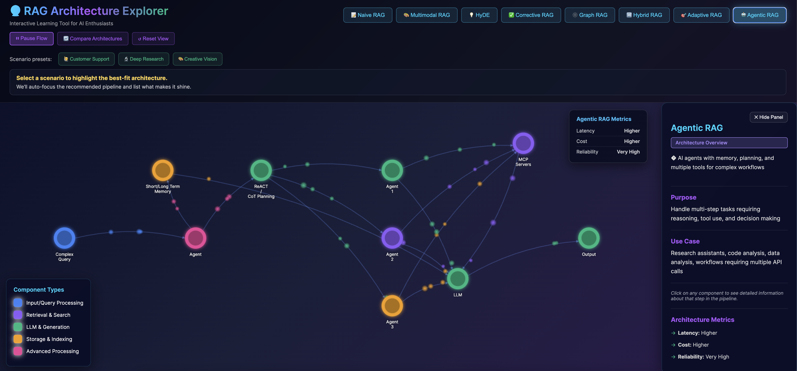

# RAG Architecture Explorer 🚀

An **interactive visualization tool** for understanding and comparing 8 different Retrieval-Augmented Generation (RAG) architectures. Built with vanilla HTML/CSS/JavaScript - no frameworks, no dependencies, just pure web technology.



## ✨ Features

### 🎯 **8 Complete RAG Architectures**
- **Naive RAG** - Simple retrieval and generation
- **Multimodal RAG** - Text, images, audio, video processing
- **HyDE** - Hypothetical Document Embeddings for better retrieval
- **Corrective RAG** - Self-correcting with web search fallback
- **Graph RAG** - Knowledge graph-based retrieval
- **Hybrid RAG** - Vector + Graph database combination
- **Adaptive RAG** - Smart query routing based on complexity
- **Agentic RAG** - Multi-agent orchestration with memory

### 🎨 **Interactive Learning**
- **Path Tracing** - Click any node to highlight the complete data flow with animated glowing edges
- **Scenario Presets** - Jump to recommended architectures for specific use cases:
  - 🙋 Customer Support → Corrective RAG
  - 🔬 Deep Research → Graph RAG
  - 🎨 Creative Vision → Multimodal RAG
- **Component Details** - Click nodes for in-depth technical information
- **Animated Particles** - Visual data flow showing how information moves through each architecture

### 📊 **Performance Metrics**
- Real-time comparison panel showing:
  - ⚡ Latency (Fast/Medium/Slow)
  - 💰 Cost (Low/Medium/High)
  - ✅ Reliability (Moderate/High/Very High)
- Per-node performance insights

### 🎯 **Professional UI**
- Glassmorphism design with blur effects
- Responsive layout (desktop & mobile)
- Canvas-based rendering for smooth animations
- Dark theme optimized for extended viewing

## 🚀 Quick Start

### Option 1: Direct Use
1. Download `rag_explorer.html`
2. Open in any modern browser (Chrome, Firefox, Safari, Edge)
3. Start exploring!

### Option 2: Local Server (Recommended for Development)
```bash
# Using Python 3
python -m http.server 8000

# Using Node.js
npx http-server

# Then open: http://localhost:8000/rag_explorer.html
```

## 📖 How to Use

### Basic Navigation
1. **Select Architecture** - Click any of the 8 architecture buttons at the top
2. **Explore Components** - Click nodes to see detailed technical information
3. **Trace Data Flow** - Selected nodes highlight the complete path with glowing edges
4. **View Metrics** - Check the performance panel (top-right) for architecture comparison

### Scenario-Based Learning
1. Click a scenario button (🙋 Customer Support, 🔬 Deep Research, 🎨 Creative Vision)
2. The tool automatically switches to the recommended architecture
3. Read the scenario explanation in the info panel
4. Explore why this architecture fits the use case

### Understanding the Visuals
- **Blue nodes** = Input (queries, data sources)
- **Purple nodes** = Processing (embedding, analysis)
- **Orange nodes** = Storage (databases, memory)
- **Green nodes** = Generation/Output (LLMs, responses)
- **Animated particles** = Data flowing through the system
- **Glowing edges** = Active path when you click a node

## 🛠️ Technical Details

### Architecture
- **Single HTML File** - Everything bundled for easy distribution
- **Vanilla JavaScript** - No frameworks, no build process
- **Canvas API** - High-performance rendering for animations
- **CSS3 Animations** - Smooth transitions and effects

### Browser Compatibility
- ✅ Chrome/Edge 90+
- ✅ Firefox 88+
- ✅ Safari 14+
- ✅ Mobile browsers (iOS Safari, Chrome Mobile)

### Performance
- Optimized canvas rendering at 60 FPS
- Efficient particle system with pooling
- Responsive design scales to any screen size
- No external dependencies = Fast load times

## 🎓 Educational Use Cases

This tool is perfect for:
- **AI/ML Students** - Visual understanding of RAG architectures
- **Developers** - Choosing the right RAG approach for projects
- **Technical Writers** - Creating documentation and tutorials
- **Educators** - Teaching retrieval-augmented generation concepts
- **Product Teams** - Evaluating RAG solutions for business needs

## 🔧 Customization

Want to modify the tool? Key sections to know:

### Adding a New Architecture
```javascript
// Find the 'architectures' object around line 840
architectures.yourArchitecture = {
    name: 'Your Architecture Name',
    description: '🎯 Brief description',
    purpose: 'What problem it solves',
    useCase: '💼 Real-world examples',
    metrics: { latency: 'Fast', cost: 'Low', reliability: 'High' },
    nodes: [
        // Define your nodes here
    ],
    edges: [
        // Define connections here
    ]
};
```

### Adding a Scenario
```javascript
// Find the 'scenarios' object around line 816
scenarios.yourScenario = {
    label: 'Your Scenario',
    icon: '🎯',
    recommended: 'architecture_key',
    summary: 'Brief explanation',
    focus: ['Key point 1', 'Key point 2', 'Key point 3']
};
```

### Styling
- **Colors** - CSS variables defined in `:root` (line 24-31)
- **Animations** - Keyframes and transitions throughout CSS
- **Layout** - Flexbox and positioning in styles section

## 🤝 Contributing

Contributions are welcome! Here's how you can help:

1. **Report Bugs** - Open an issue with details
2. **Suggest Features** - Ideas for new architectures or UI improvements
3. **Improve Documentation** - Help make explanations clearer
4. **Add Architectures** - Propose new RAG patterns
5. **Optimize Performance** - Better rendering or animations

### Development Workflow
```bash
# 1. Fork the repository
# 2. Make your changes to rag_explorer.html
# 3. Test in multiple browsers
# 4. Submit a pull request with clear description
```

## 📄 License

MIT License - Free to use, modify, and distribute

Copyright (c) 2025 Al Hashemi (Aether Hive)

See LICENSE file for full details.

## 🙏 Acknowledgments

Built with love for the AI/ML community. Special thanks to:
- The open source RAG community for architecture patterns
- Developers sharing knowledge about retrieval systems
- Everyone pushing the boundaries of AI-augmented applications

## 📬 Contact

Created by **Al** - Creative AI Specialist at Cellavent Healthcare
- LinkedIn: (https://www.linkedin.com/in/al-hashemi/)
- GitHub: (https://github.com/darealone)


---

**Found this useful?** ⭐ Star the repo to show support!

**Have questions?** 💬 Open an issue or start a discussion!

**Want to see more?** 🔔 Watch the repository for updates!
